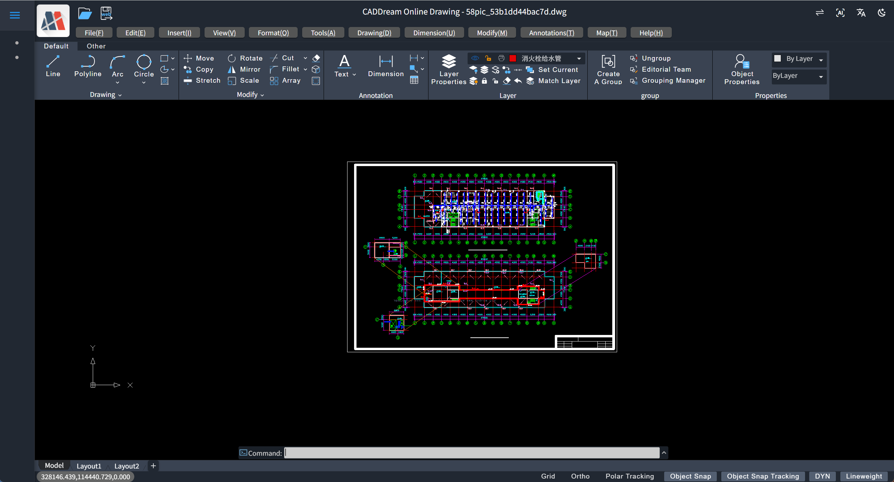

# mxcad-app

[](https://badge.fury.io/js/mxcad-app)

`mxcad-app` is an online CAD project that users can directly integrate into their applications.

If you want to view more content related to mxcad, You can visit the mxcad official website：https://www.webcadsdk.com/mxcad/

The preview of the mxcad-app integration effect is as follows：


## 🎯 One-Sentence Summary

**mxcad-app = a ready-to-use online CAD software** — integrating it into your web page is as simple as building with blocks. You can equip your website with professional CAD capabilities in just 3 minutes.

## 📦 Installation

Install `mxcad-app` using npm or yarn:

```bash
npm install mxcad-app --save
```

or

```bash
yarn add mxcad-app
```

## 🚀 Usage (Get Started in 3 Minutes)

### Based on Vite

main.js

```js
import "mxcad-app/style";
import { MxCADView } from "mxcad-app";
new MxCADView().create();
```

vite.config.js

```js
import { defineConfig } from "vite";
import { mxcadAssetsPlugin } from "mxcad-app/vite";

export default defineConfig({
  plugins: [mxcadAssetsPlugin()],
});
```

### Based on Webpack

webpack.config.js

```js
const { MxCadAssetsWebpackPlugin } = require("mxcad-app/webpack");
// webpack.config.js
const webpack = require("webpack");

module.exports = {
  // ...
  mode: "development",
  module: {
    rules: [
      {
        test: /\.css$/, // Match all .css files
        use: [
          "style-loader", // Step 2: Inject CSS into DOM via <style> tag
          "css-loader", // Step 1: Parse CSS, handle @import and url()
        ],
        include: [path.resolve(__dirname, "src"), path.resolve(__dirname, "node_modules/mxcad-app")], // Optional: only process CSS under src
      },
    ],
  },
  plugins: [
    new webpack.ContextReplacementPlugin(
      /mxcad-app/, // Match module paths containing mxcad-app
      path.resolve(__dirname, "src") // Limit context lookup scope
    ),
    new MxCadAssetsWebpackPlugin(),
  ],
  // ...
  devServer: {
    static: "./dist",
    port: 3000,
  },
};
```

main.js

```js
import "mxcad-app/style";
import { MxCADView } from "mxcad-app";
new MxCADView().create();
```

## 🛠️ Advanced Configuration

### Custom Container

```html
<div id="app"></div>
```

```js
import { MxCADView, mxcadApp } from "mxcad-app";
new MxCADView({
  openFile: new URL("test.mxweb", mxcadApp.getStaticAssetPath()).toString(),
  rootContainer: "#app",
});
```

### Static Asset Settings

You can set static asset paths by calling `setStaticAssetPath`:

```js
import { mxcadApp } from "mxcad-app";
mxcadApp.setStaticAssetPath("https://unpkg.com/mxcad-app/dist/mxcadAppAssets");
```

## Core Dependencies

`mxcad-app` includes the [`mxcad`](https://www.mxdraw3d.com/mxcad_docs/zh/1.%E5%BC%80%E5%A7%8B/2.%E5%BF%AB%E9%80%9F%E5%85%A5%E9%97%A8.html) core library. You can use `mxcad` directly without installing it separately.

```js
import { MxCpp } from "mxcad";
```

If not using a module system, `mxcad` is mounted on `window.MxCAD`, allowing direct access to its methods and classes via `MxCAD`.

`mxcad` depends on `mxdraw`, which you can also use directly:

```js
import * as Mx from "mxdraw";
```

If not using modules, `mxdraw` is available on `window.Mx`. You can access its methods and classes directly via `Mx`.

To import `mxcad` and `mxdraw` modules directly, you must use a build tool. We provide plugins for Webpack and Vite to support modular development.

Once the plugin is used, you can directly `import` the `mxcad` and `mxdraw` modules.

### Using mxcad-app Dependency Mapping

You can directly import and use the `mxcad` and `mxdraw` modules internally used by `mxcad-app`. You can also add the `libraryNames` configuration to use other external npm libraries.

Currently supported mapped libraries include: `vue`, `axios`, `vuetify`, `vuetify/components`, `mapboxgl`, `pinia`. You can also access `window.MXCADAPP_EXTERNALLIBRARIES` to retrieve all provided dependencies, enabling usage without a build tool.

For example, to use the Vue framework, simply add the dependency mapping configuration like this:

vite.config.js

```js
import { mxcadAssetsPlugin } from "mxcad-app/vite";
// vite.config.js
export default {
  plugins: [
    mxcadAssetsPlugin({
      libraryNames: ["vue"],
    }),
  ],
};
```

webpack.config.js

```js
import { MxCadAssetsWebpackPlugin } from "mxcad-app/webpack";
// webpack.config.js
module.exports = {
  // Other configurations...
  plugins: [
    new MxCadAssetsWebpackPlugin({
      libraryNames: ["vue"],
    }),
  ],
};
```

After this, you can use the Vue module bundled within `mxcad-app` normally:

```js
import { ref } from "vue";
const n = ref(1);
```

## 🛠️ Runtime Configuration Modification

Modify configurations at build time:

### Vite

```js
import { mxcadAssetsPlugin } from "mxcad-app/vite";

export default {
  plugins: [
    mxcadAssetsPlugin({
      // Modify UI configuration
      transformMxcadUiConfig: (config) => {
        config.title = "My CAD"; // Change title
        return config;
      },
      // Modify server configuration
      transformMxServerConfig: (config) => {
        config.serverUrl = "/api/cad"; // Change API endpoint
        return config;
      },
      // Modify quick command (command aliases)
      // transformMxQuickCommand: (config) => config

      // Modify Sketches and Notes UI mode configuration
      // transformMxSketchesAndNotesUiConfig: (config) => config

      // Modify UI configuration
      // transformMxUiConfig: (config) => config,

      // Modify Vuetify theme configuration
      // transformVuetifyThemeConfig: (config) => config
    }),
  ],
};
```

### Webpack

```js
import { MxCadAssetsWebpackPlugin } from "mxcad-app/webpack";

module.exports = {
  plugins: [
    new MxCadAssetsWebpackPlugin({
      transformMxServerConfig: (config) => {
        if (process.env.NODE_ENV === "production") {
          config.serverUrl = "https://api.prod.com/cad";
        }
        return config;
      },
    }),
  ],
};
```

## mxcad-app secondary development of CAD-related functions

By following the above steps, we can obtain the original MxCAD project that initially integrates the `mxcad-app` plugin. If we need to carry out secondary development on the original MxCAD project, we can directly extend the functions of the mxcad project through the core dependency libraries of `mxcad` and `mxdraw` in the `mxcad-app`. The following takes the implementation of parametric drawing and the invocation of internal MxCAD commands in a vue project as an example.

Among them, the link to the mxcad development documentation：https://mxcad.github.io/mxcad/en/
Among them, the link to the mxdraw development documentation：https://mxcad.github.io/mxdraw/en/

1. Parametric drawing extension

   ```ts
   import { McGePoint3d, MxCpp } from "mxcad";

   //Draw a circle with a center of (0,0) and a radius of 100 in MxCAD
   const drawCircle = () => {
     //Obtain the current mxcad object
     const mxcad = MxCpp.getCurrentMxCAD();
     //Create a new canvas
     mxcad.newFile();
     mxcad.drawCircle(0, 0, 100);
     mxcad.zoomAll();
   };
   //You can directly execute the drawCircle() method to draw the target circle on the drawing
   drawCircle();
   ```

2. Directly invoke the internal commands of MxCAD

   ```ts
   import { MxFun } from "mxdraw";
   // Invoke the internal line drawing command of MxCAD
   MxFun.sendStringToExecute("Mx_line");
   ```

   The registration command operates in the same way as above. First, call the relevant API of mxcad to implement the CAD function method, and then call the internal API of MxFun to register the command.

   ```ts
   import { MxFun } from "mxdraw"

   const testFun = () => {
     ....
   };
   // Registration command
   MxFun.addCommand("Mx_testFun", testFun);
   ```

## 🤖 AI Integration

This project includes AI integration through OpenRouter API. To enable this feature:

1. Obtain an API key from [OpenRouter](https://openrouter.ai/)
2. Add the API key to your environment variables:
   ```
   VITE_OPENROUTER_API_KEY=your_openrouter_api_key_here
   ```

The AI chat component is available in the application and allows you to interact with AI models like DeepSeek.

## 📚 Quick FAQ

**Q: Which CAD formats are supported?**  
A: Mainstream formats such as DWG, DXF, and custom formats (mxweb)

**Q: Do I need to install CAD software?**  
A: No! It's a pure web solution — runs directly in your browser.

**Q: Can it be integrated into existing systems?**  
A: Yes! You can seamlessly integrate it using `mxcad-app`.

## 📄 License

`mxcad-app` is under a custom license. For more information, please see the [LICENSE](./LICENSE) file.
