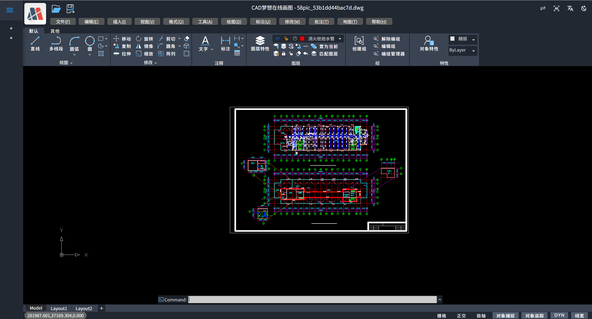

# mxcad-app

[](https://badge.fury.io/js/mxcad-app)

`mxcad-app` 是一个在线 CAD 项目, 用户可以直接集成它。

如果想要查看更多mxcad相关内容，可前往mxcad官网：https://www.webcadsdk.com/mxcad/

mxcad-app 集成效果预览如下：


## 🎯 一句话理解

**mxcad-app = 一个开箱即用的在线 CAD 软件**，集成到你的网页就像搭积木一样简单，3 分钟就能让你的网站拥有专业 CAD 功能。

## 📦 安装

使用 npm 或 yarn 安装 `mxcad-app`：

```bash
npm install mxcad-app --save
```

或者

```bash
yarn add mxcad-app
```

## 🚀 使用方法（3 分钟搞定）

### 基于 vite

main.js

```js
import "mxcad-app/style";
import { MxCADView } from "mxcad-app";
new MxCADView().create();
```

vite.config.js

```js
import { defineConfig } from "vite";
import { mxcadAssetsPlugin } from "mxcad-app/vite";

export default defineConfig({
  plugins: [mxcadAssetsPlugin()],
});
```

### 基于 webpack

webpack.config.js

```js
const { MxCadAssetsWebpackPlugin } = require("mxcad-app/webpack");
// webpack.config.js
const webpack = require("webpack");

module.exports = {
  // ...
  mode: "development",
  module: {
    rules: [
      {
        test: /\.css$/, // 匹配所有 .css 文件
        use: [
          "style-loader", // 第二步：将 CSS 代码注入到 DOM 的 <style> 标签中
          "css-loader", // 第一步：解析 CSS 文件，处理 @import 和 url()
        ],
        include: [path.resolve(__dirname, "src"), path.resolve(__dirname, "node_modules/mxcad-app")], // 可选：只处理 src 下的 css
      },
    ],
  },
  plugins: [
    new webpack.ContextReplacementPlugin(
      /mxcad-app/, // 匹配包含 mxcad-app 的模块路径
      path.resolve(__dirname, "src") // 限制上下文查找范围
    ),
    new MxCadAssetsWebpackPlugin(),
  ],
  // ...
  devServer: {
    static: "./dist",
    port: 3000,
  },
};
```

main.js

```js
import "mxcad-app/style";
import { MxCADView } from "mxcad-app";
new MxCADView().create();
```

## 🛠️ 进阶配置

### 自定义容器

```html
<div id="app"></div>
```

```js
import { MxCADView, mxcadApp } from "mxcad-app";
new MxCADView({
  openFile: new URL("test.mxweb", mxcadApp.getStaticAssetPath()).toString(),
  rootContainer: "#app",
});
```

### 静态资源设置

静态资源设置可以通过调用`setStaticAssetPath`

```js
import { mxcadApp } from "mxcad-app";
mxcadApp.setStaticAssetPath("https://unpkg.com/mxcad-app/dist/mxcadAppAssets");
```

## 核心依赖库

`mxcad-app`内置了[`mxcad`](https://www.mxdraw3d.com/mxcad_docs/zh/1.%E5%BC%80%E5%A7%8B/2.%E5%BF%AB%E9%80%9F%E5%85%A5%E9%97%A8.html) 核心库，你可以直接使用`mxcad` 不需要安装`mxcad`。

```js
import { MxCpp } from "mxcad";
```

如果不是模块化的方式使用,`mxcad`在`window.MxCAD`挂载你可以直接使用`MxCAD`访问到需要的方法和类。

`mxcad`依赖`mxdraw`, 你也可以使用`mxdraw`

```js
import * as Mx from "mxdraw";
```

如果不是模块化的方式使用, `mxdraw` 在 `window.Mx` 挂载。你可以直接使用`Mx`访问到需要的方法和类。

直接引入`mxcad`和`mxdraw`模块的前提是要使用构建工具构建。我们提供给了 webpack 和 vite 的插件, 用于支持模块化开发。

只要使用了插件就可以直接使用`import`引入`mxcad`和`mxdraw`模块。

### 使用 mxcad-app 依赖映射

你可以直接引入使用 mxcad-app 内部使用的 mxcad 和 mxdraw 模块。同时你也可以添加配置`libraryNames`使用其他的外部依赖的 npm 库。
目前支持的依赖映射的库有`vue`, `axios`, `vuetify`, `vuetify/components`, `mapboxgl`, `pinia` 你也可以访问`window.MXCADAPP_EXTERNALLIBRARIES`获取到所有提供的依赖库，从而不依赖与构建工具的使用。
比如`vue`框架,只需要添加依赖映射配置， 如:
vite.config.js

```js
import { mxcadAssetsPlugin } from "mxcad-app/vite";
// vite.config.js
export default {
  plugins: [
    mxcadAssetsPlugin({
      libraryNames: ["vue"],
    }),
  ],
};
```

webpack.config.js

```js
import { MxCadAssetsWebpackPlugin } from "mxcad-app/webpack";
// webpack.config.js
module.exports = {
  // 其他配置...
  plugins: [
    new MxCadAssetsWebpackPlugin({
      libraryNames: ["vue"],
    }),
  ],
};
```

就可以正常使用 mxcad-app 中的 vue 模块（mxcad-app 打包的内部 vue 模块）

```js
import { ref } from "vue";
const n = ref(1);
```

## 🛠️ 运行时配置修改

在构建时修改配置文件：

### vite

```js
import { mxcadAssetsPlugin } from "mxcad-app/vite";

export default {
  plugins: [
    mxcadAssetsPlugin({
      // 修改UI配置
      transformMxcadUiConfig: (config) => {
        config.title = "我的CAD"; // 修改标题
        return config;
      },
      // 修改服务器配置
      transformMxServerConfig: (config) => {
        config.serverUrl = "/api/cad"; // 修改API地址
        return config;
      },
      // 修改快捷命令(命令别名)
      // transformMxQuickCommand: (config) => config

      // 修改草图与注释UI模式的配置
      // transformMxSketchesAndNotesUiConfig: (config) => config

      // 修改UI配置
      // transformMxUiConfig: (config) => config,

      // 修改Vuetify主题配置
      // transformVuetifyThemeConfig: (config) => config
    }),
  ],
};
```

### webpack

```js
import { MxCadAssetsWebpackPlugin } from "mxcad-app/webpack";

module.exports = {
  plugins: [
    new MxCadAssetsWebpackPlugin({
      transformMxServerConfig: (config) => {
        if (process.env.NODE_ENV === "production") {
          config.serverUrl = "https://api.prod.com/cad";
        }
        return config;
      },
    }),
  ],
};
```

## mxcad-app 二次开发 CAD 相关功能

按照上述步骤操作，我们就能得到初步集成`mxcad-app`插件的原始 MxCAD 项目。如果我们需要在原始 MxCAD 项目上做二次开发，可以直接通过`mxcad-app`的`mxcad`和`mxdraw`核心依赖库来对 MxCAD 项目做功能扩展。下面以在 vue 项目中的 MxCAD 中实现参数化绘图和调用 MxCAD 内部命令为例。

其中 mxcad 开发文档链接：https://mxcad.github.io/mxcad/zh/
其中 mxdraw 开发文档链接：https://mxcad.github.io/mxdraw/

1. 参数化绘图扩展

   ```ts
   import { McGePoint3d, MxCpp } from "mxcad";

   //在MxCAD中绘制一个圆心在（0，0），半径为100的圆
   const drawCircle = () => {
     //获取当前mxcad对象
     const mxcad = MxCpp.getCurrentMxCAD();
     //创建新画布
     mxcad.newFile();
     mxcad.drawCircle(0, 0, 100);
     mxcad.zoomAll();
   };
   //直接执行drawCircle()方法即可在图纸中绘制目标圆
   drawCircle();
   ```

2. 直接调用 MxCAD 内部命令

   ```ts
   import { MxFun } from "mxdraw";
   // 调用MxCAD内部绘直线命令
   MxFun.sendStringToExecute("Mx_line");
   ```

   注册命令也是同上面一样的操作，首先调用 mxcad 相关 API 实现 CAD 功能方法，再调用 MxFun 内部 API 注册命令。

   ```ts
   import { MxFun } from "mxdraw"

   const testFun = () => {
     ....
   };
   // 注册命令
   MxFun.addCommand("Mx_testFun", testFun);
   ```

## 📚 常见问题速查

**Q: 支持哪些 CAD 格式？**
A: DWG、DXF 等主流格式以及自定义文件格式(mxweb)

**Q: 是否需要安装 CAD 软件？**
A: 不需要！纯 Web 方案，浏览器就能用

**Q: 能否集成到现有系统？**
A: 可以！直接使用 mxcad-app 就可以无缝集成

## 📄 许可证

`mxcad-app` 是自定义许可证。更多信息，请参阅 [LICENSE](./LICENSE) 文件。

---

如果有任何问题或建议，请随时联系我们。
